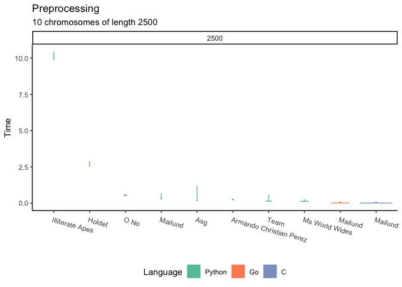
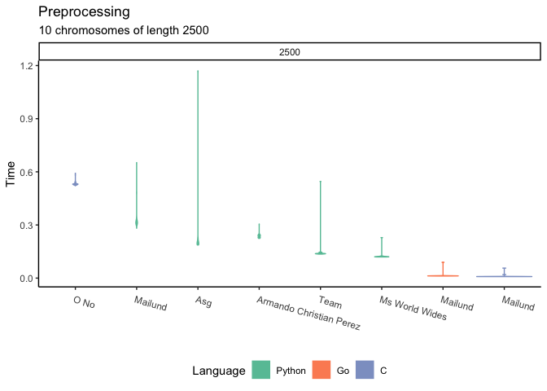
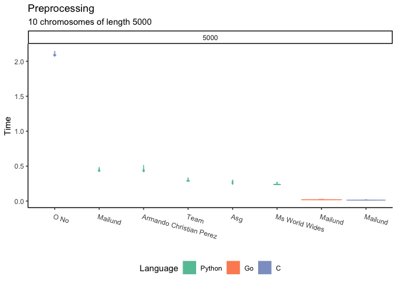
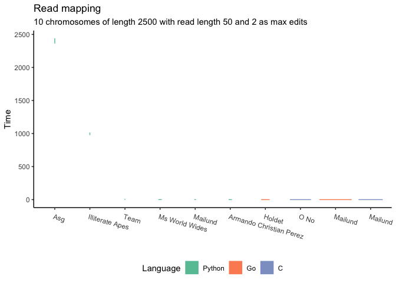
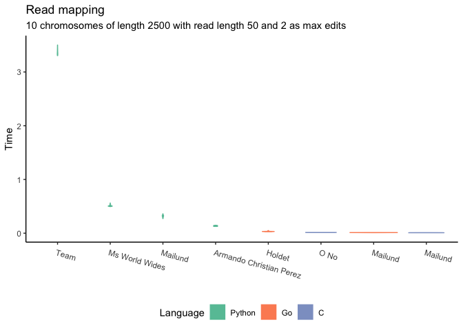
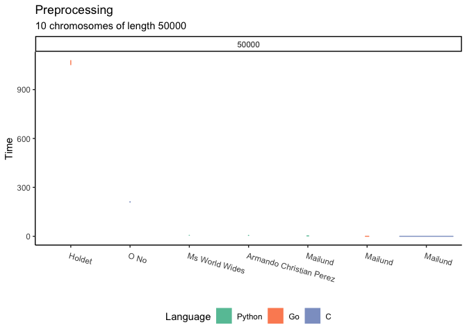
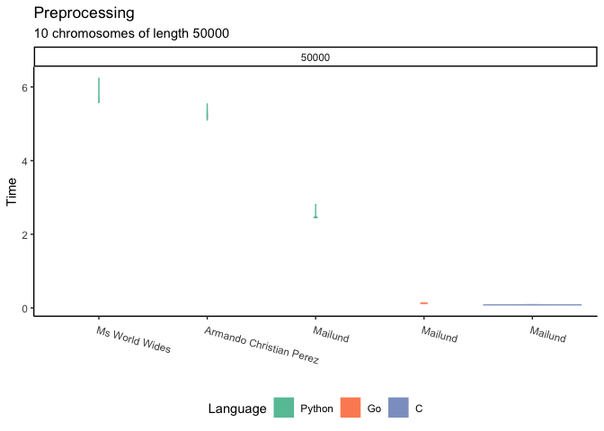
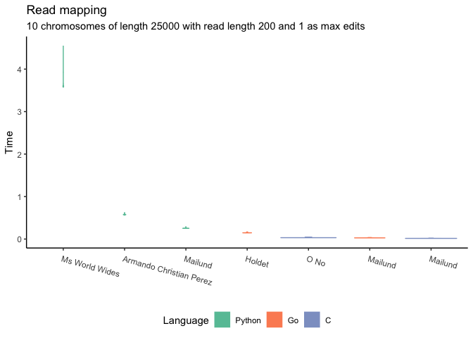
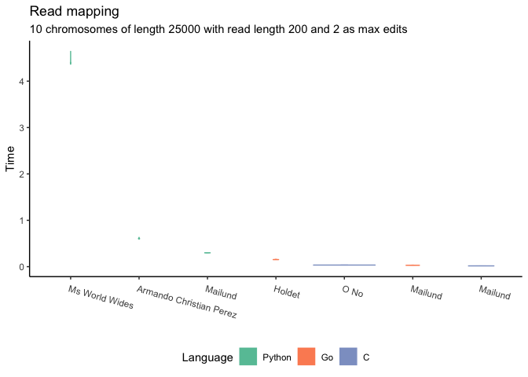
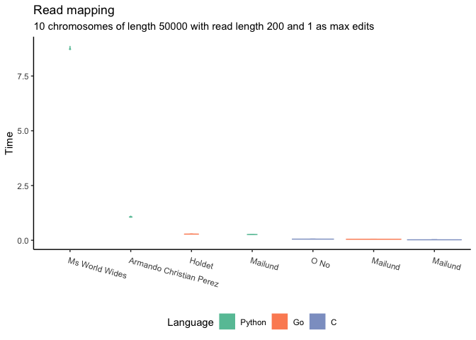

<!-- ## Status of projects -->
<!--

|Team                    |Language |Status |
|:-----------------------|:--------|:------|
|armando-christian-perez |Python   |pass   |
|team                    |Python   |fail   |
|illiterate-apes         |Python   |fail   |
|holdet                  |Go       |pass   |
|o-no                    |C        |pass   |
|quadratic-solution      |C        |fail   |
-->

## Preprocessing performance (all teams)

I first ran all tools on small data sets (genomes with 10 chromosomes of
length 2500 or 5000). This is a truly tiny size for a genome, and
everyone should be able to handle that. After that, we can compare the
faster tools with larger genomes.

I have included all student projects plus three of my own: one
read-mapper in each language (Python, Go, and C). My own implementations
are roughly equivalent, except for language, and except where language
features makes one solution more natural than another: for Go, using
closures to iterate through solutions while in Python you more naturally
use generators, and in C I use a state machine.

Without further ado, here are the results:

The solutions are sorted in descending order according to their mean
running time over 20 repeats, so the father right you get, the faster
the tool.

Except for a few outliers at the left end, the tools have comparable
running time. This is partly because we are looking at such a small data
set (spoiler alert) and because the slow contestants push the other
tools down close to zero when I fit all the time measurements on the
same y-axis.

If we remove the two slowest teams we get a bit more detail for the
rest:

## Mapping performance (all teams)

The preprocessing isn’t everything, of course. As long as it is fast
enough to handle a genome in reasonable time, it is more important that
the mapping is fast. You tend to only preprocess a genome once, but you
will map against it many times.

So, I measured the time it would take to map reads of length 200 (a
small to medium length for reads) allowing one or two edits against the
two sizes of genomes.

We are in much the same situation as with preprocessing, where it is
hard to see how the majority of teams compare because of the extreme
time the slowest tools use, but if we remove the two slowest again we
get:

## Longer genomes

Now let’s take the data size up from toy examples to something within
three or four orders of magnitude from real data for the tools that can
handle that: we increase the chromosome lengths to 25,000 or 50,000. For
small data sets, the running time can be affected by tiny algorithmic or
programming choices, but when we increase the data we get a much better
feeling of the overall quality of solutions. Based on the results above,
I found it necessary to exclude “Illiterate Apes”, “Team”, and “Asg”
from this part of the evaluation.

### Preprocessing

Again, let’s first consider the preprocessing time:

It looks like the benefits you would expect from implementing in Go (for
“Holdet”) or C (for “O No”) didn’t quite compensate for some algorithmic
choices in implementing the suffix array construction algorithm. If we
remove these teams we can see how the remaining tools compare:

There is not a huge difference any longer. The C and Go implementations
have an unreasonable advantage by being compiled languages, but the
Python tools are roughly the same.

### Mapping

Turning to mapping, I ran with reads of 200 and one or two edits, just
as before. The results are these:

If we remove the slowest (sorry “Ms World Wides”) we get:

