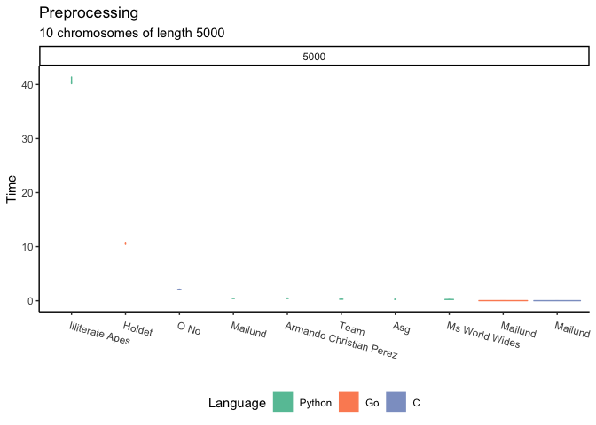
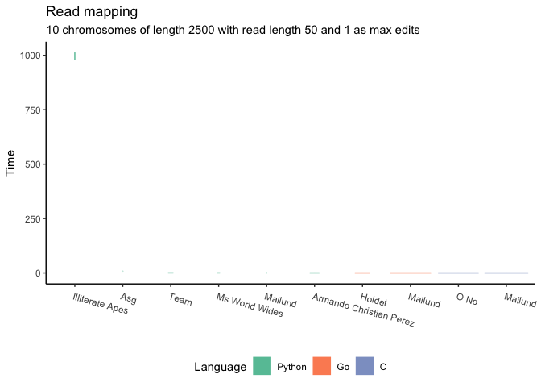
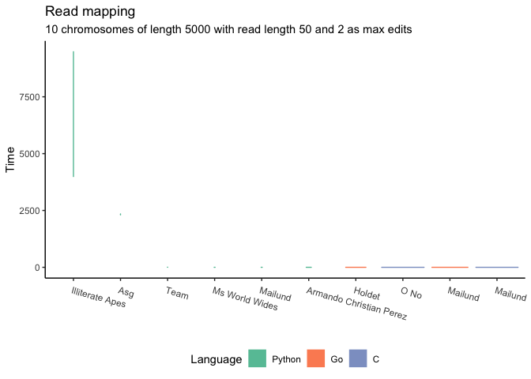
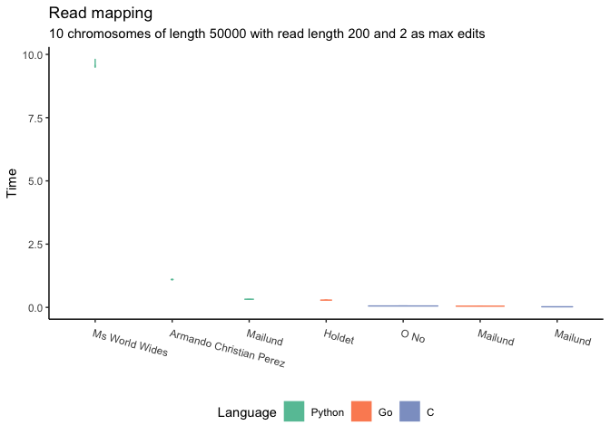

# Readmapper performance report

This is an autogenerated report of the current performance of
readmappers that pass the Github Actions tests.

## Status of projects

<table>
<thead>
<tr class="header">
<th style="text-align: left;">Team</th>
<th style="text-align: left;">Language</th>
<th style="text-align: left;">Status</th>
</tr>
</thead>
<tbody>
<tr class="odd">
<td style="text-align: left;">asg</td>
<td style="text-align: left;">Python</td>
<td style="text-align: left;">fail</td>
</tr>
<tr class="even">
<td style="text-align: left;">armando-christian-perez</td>
<td style="text-align: left;">Python</td>
<td style="text-align: left;">pass</td>
</tr>
<tr class="odd">
<td style="text-align: left;">team</td>
<td style="text-align: left;">Python</td>
<td style="text-align: left;">fail</td>
</tr>
<tr class="even">
<td style="text-align: left;">illiterate-apes</td>
<td style="text-align: left;">Python</td>
<td style="text-align: left;">fail</td>
</tr>
<tr class="odd">
<td style="text-align: left;">holdet</td>
<td style="text-align: left;">Go</td>
<td style="text-align: left;">pass</td>
</tr>
<tr class="even">
<td style="text-align: left;">o-no</td>
<td style="text-align: left;">C</td>
<td style="text-align: left;">pass</td>
</tr>
<tr class="odd">
<td style="text-align: left;">quadratic-solution</td>
<td style="text-align: left;">C</td>
<td style="text-align: left;">fail</td>
</tr>
</tbody>
</table>

## Preprocessing performance (full competition)

## Mapping performance (full list)

## Competitors

These are the teams that are fast enough for a longer run. Improve your
speed to get on it.

### Preprocessing

### Mapping

